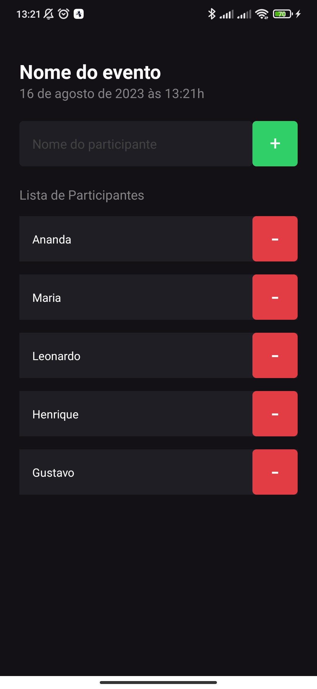

# ImHere - React Native Mobile Application

In this repository you can acess the code of the ImHere application. It's a react native project that consists in a list where you can add, remove and update the participants of your event. This application will help you list the participants so that you can organize your event in a better way. Feel free to use this application for your own purposes.

## Preview



## 🚀 How can I set up the application?

First of all, clone the project in your computer.

```bash
  git clone git@github.com:gustavogarciac/imhere-react-native.git
```

---

### 💫 Running the application

```bash
  // Install necessary dependencies
  $ npm install

  //Run the server
  $ npm start

  // Scan the QR CODE in your Expo Go smartphone application, or run it in your emulator.

```

## 🚀 Technologies

- React
- React Native
- TypeScript
- Date-Fns

## 💻 Copywright

Feel free to use this material to your own projects. Keep studying, we can change the world!
